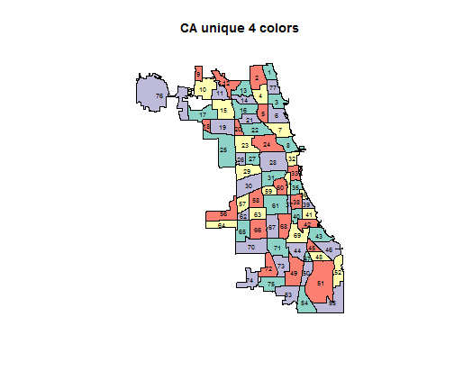
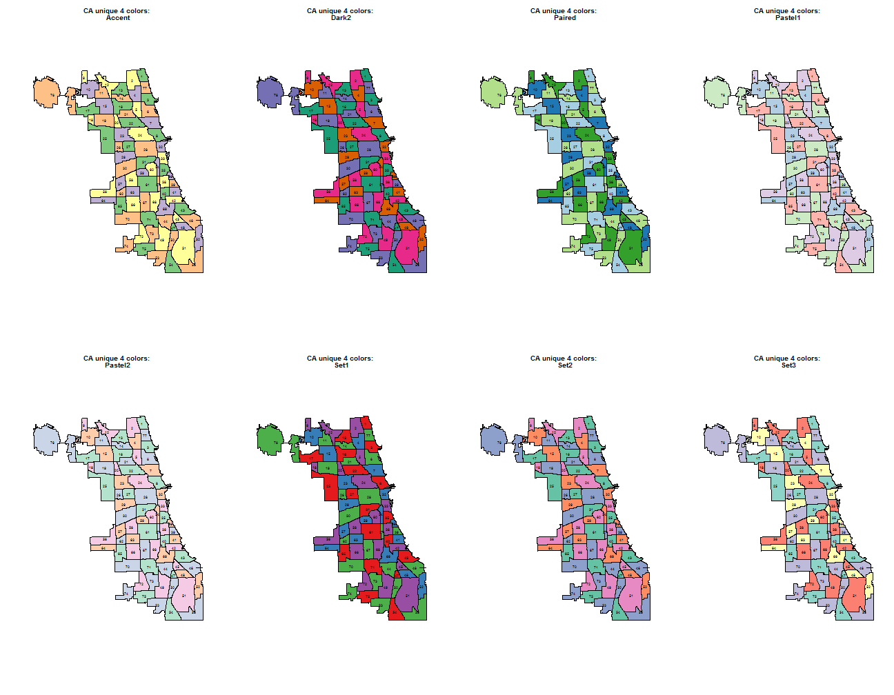

Mapping Example: Coloring neighboring polygons in 4 different colors
========================================================

This example, create a neighboring polygon index - to show neighboring polygons in 4 different colors. The main R code to assign 4 different classes was taken from now-archived "gcolor" library code, ineq.R* - downloaded from: http://cran.r-project.org/src/contrib/Archive/gcolor/. * NOT to be confused with "ineq"" tool in the ineq library, which has nothing to do with "gcolor" library tools.

For more discussion on the method, visit the following discussion thread: http://r-sig-geo.2731867.n2.nabble.com/Colouring-maps-so-that-adjacent-polygons-differ-in-colour-td6237661.html .


```r
setwd("F:/Prof_Chin/CDPH/SpatialPatterns")
library(spdep)
stateplane<-CRS("+proj=tmerc +lat_0=36.66666666666666 +lon_0=-88.33333333333333 +k=0.999975 +x_0=300000 +y_0=0 +ellps=GRS80 +datum=NAD83 +to_meter=0.3048006096012192")
cashp<-readShapeSpatial("commareas_lbw.shp", ID="id", proj4string=stateplane)
cashp.queen<-poly2nb(cashp,queen=T)
cashp.queen.mat<-nb2mat(cashp.queen,style="B")
# copied from gcolor>R>ineq.R file
ineq<-function(a)
{
a1<-a
ra<-nrow(a) #size of matrix a (n) 
s<-1:ra # initial solution vector (1:n)
while(sum(a==0)>ra) #while some off-diagonal zeros remain 
{                   #begin main loop
a2<-a%*%a #square the a matrix: a2=a**2
x<-row(a) #find row i values for each element in matrix a
y<-col(a) #find column j values for each element in matrix a
c<-x<y    #select upper triangular portion of a
w<-a[c]   #select all values in upper triangular portion of a
x<-x[c]   #find corresponding i values
y<-y[c]   #find corresponding j values
z<-a2[c]  #find corresponding a2 values
d<-w==0   #only consider cases where a[i,j]=0
x<-x[d]   #find corresponding i values
y<-y[d]   #find corresponding j values
z<-z[d]   #find corresponding a2 values
e<-rev(order(z)) #need to reverse increasing order to get the maximum 
x<-x[e]   #i values in decreasing order of a2
y<-y[e]   #j values in decreasing order of a2
i<-x[1] #extract i value corresponding to max(a2) 
j<-y[1] #extract j value corresponding to max(a2)
if(i>j) #ensure that i<j for correct update of s
{
tmp<-i  #if i>j reverse i and j
i<-j
j<-tmp
}
u<-a[i,] #select row i of a
v<-a[j,] #select row j of a
uv<-u|v  #bitwise logical or of row i and row j
a[i,]<-uv #replace row i of a
a[,i]<-uv #replace column i of a
a<-a[-j,-j] #remove row j and column j from a
s[s==j]<-i  #begin update solution vector s
s<-s-(1)*(s>j) #complete update of solution vector s
ra<-ra-1 #dimension of matrix a reduced by 1
}        #end of main loop  
a<-a1 #restore a to original input matrix
z<-order(s) #find ordering of solution vector
bdfa<-a[z,z] #put matrix a into block diagonal form
z<-s[z] #z is solution vector of block diagonal form of a
#print(bdfa) #print matrix a in block diagonal form (disabled) 
return(s) #return solution vector s for input matrix a
}
gcol<-ineq(cashp.queen.mat)
cashp$gcol<-as.factor(gcol)
# save the result in a text file - to be used in ArcGIS
write.table(cashp@data,file="cashp_gcol.csv",sep=",",row.names=F)
```


Plot the result using ColorBrewer (http://colorbrewer2.org/) qualitative "Set3" scheme:


```r
# followings are good examples on mapping in R:
# http://www.cse.unsw.edu.au/~mike/myrlibrary.old/RColorBrewer/html/ColorBrewer.html
# http://math.ups.edu/~jbernhard/2008S/math260/colors.R
# http://blog.lib.umn.edu/moor0554/canoemoore/R_Workshop_Spatial_032609.pdf
# install.packages('RColorBrewer')
library(RColorBrewer)
par(mfrow = c(1, 1))
cashpxy <- coordinates(cashp)
plotvar <- cashp@data$gcol
ncolor <- 4
plotcolor <- brewer.pal(ncolor, "Set3")
plot(cashp, col = plotcolor[as.numeric(plotvar)])
text(cashpxy, labels = cashp@data$areanumber, cex = 0.6)
title(main = "CA unique 4 colors")
```

 


Try different colors using ColorBrewer (http://colorbrewer2.org/) schemes:


```r
# followings are good examples on mapping in R:
# http://www.cse.unsw.edu.au/~mike/myrlibrary.old/RColorBrewer/html/ColorBrewer.html
# http://math.ups.edu/~jbernhard/2008S/math260/colors.R
# http://blog.lib.umn.edu/moor0554/canoemoore/R_Workshop_Spatial_032609.pdf
# install.packages('RColorBrewer')
par(mfrow = c(2, 4))
x <- c("Accent", "Dark2", "Paired", "Pastel1", "Pastel2", "Set1", "Set2", "Set3")
for (i in c(1:length(x))) {
    colscheme <- x[i]
    plotvar <- cashp@data$gcol
    ncolor <- 4
    plotcolor <- brewer.pal(ncolor, colscheme)
    plot(cashp, col = plotcolor[as.numeric(plotvar)])
    text(cashpxy, labels = cashp@data$areanumber, cex = 0.6)
    titletext <- paste(c("CA unique 4 colors: ", colscheme))
    title(main = titletext)
}
```

 

